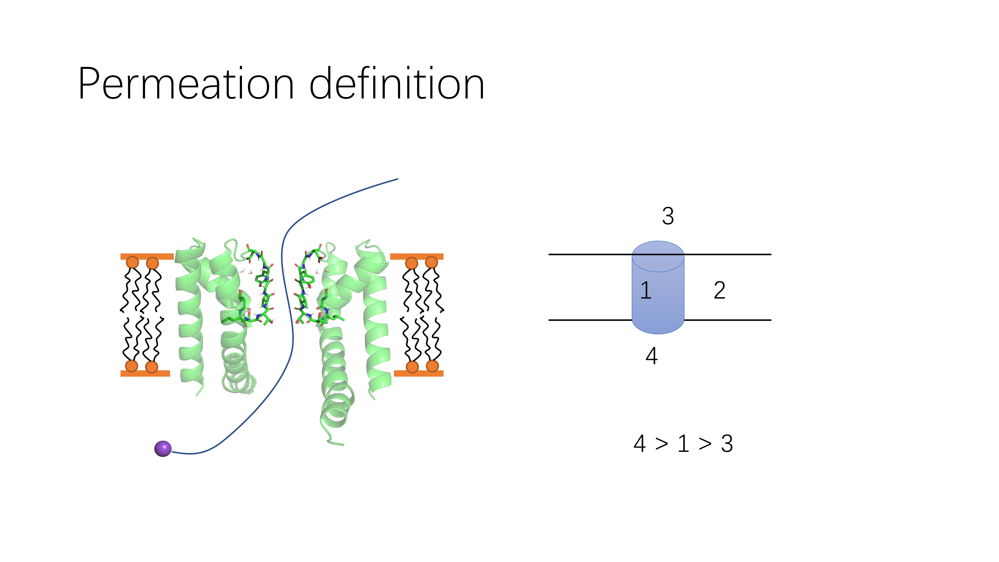

# Sfilter
This is a tool for basic analysis in Potassium Channel MD simulation.

## 1.Installation
### 1.1 Prepare conda environment
```bash
conda create -n Name_of_Env python=3.11 \
  MDAnalysis numpy pandas scipy networkx matplotlib pyemma \
  -c conda-forge -y
conda activate Name_of_Env
```
### 1.2 Install Sfilter using pip
```bash
git clone https://github.com/huichenggong/Sfilter_Cylinder
cd Sfilter_Cylinder
pip install .
```
### 1.3 add ipython kernel
```bash
conda activate Name_of_Env
conda install ipykernel ipywidgets -c conda-forge -y
python -m ipykernel install --user --name Name_of_ipykernel
```
### 1.4 update when there is a new version
```bash
cd XXX/Sfilter_Cylinder
git pull
conda activate Name_of_Env
pip install .         # this will remove the old version and reinstall the new version
count_cylinder.py -h  # check version
```

### 1.X remove/uninstall
```bash
pip uninstall Sfilter
jupyter kernelspec uninstall unwanted-kernel  # replace this with the name of your kernel
conda remove -n Name_of_Env --all  # You need to deactivate the env before this removing
```

## 2. How to use it ?
### 2.1 Analyze the xtc trajectory and count permeation.
```bash
cd test
base=$PWD
cd $base/01-NaK2K/1-Charmm/with_water
count_cylinder.py -pdb ../em.gro \
  -xtc fix_atom_c_100ps.xtc -K POT \
  -SF_seq THR VAL GLY TYR GLY > k_cylinder.out

count_cylinder.py -pdb ../em.gro \
  -xtc fix_atom_c_100ps.xtc -K POT \
  -SF_seq THR VAL GLY TYR GLY \
  -n_water 400 -reduced_xtc fix_400wat.xtc -non_wat nWat
  # You can get the water-reduced file fix_400wat_nWat.pdb and fix_400wat.xtc
  
cd ../dry/
count_cylinder.py -pdb em_dry.gro \
  -xtc fix_atom_c_100ps_dry.xtc -K K \
  -SF_seq THR VAL GLY TYR GLY > k_cylinder.out
  # There are two permeation events in this example

cd $base/03-longest_common_sequence/
match_xtck.py \
  -cylinderS 03-state-code/POT_perm_event.out \
  -perm_up 01-xtck/perm_up.dat \
  -perm_down 01-xtck/perm_down.dat
  # match result with xtck

cd $base/01-NaK2K/1-Charmm/dry/count_nojump
count_nojump.py -i in.json
# new script that runs on nojump xtc
```
The potassium permeation will be saved in `POT_perm_event.out`. Please take a look at the resident time. 
this is the time that the atom stays in the cylinder. This time should be safely smaller than the trajectory time step. 

### 2.2 Analyze the SF state distribution
```bash
cd $base/05-HRE/01-charmm-charge/distribution/
analyse_distribution.py -i NaK2K_C_HRE.json
# analysi the distribution of SF state

cd $base/06-multi_rep/01-charmm-charge/distribution
cat NaK2K_C.json
# file too large
```

## 3.What can it do?
### 3.1. Count ion permeation  

Ion permeation is defined by sequentially passing though 4,1,3 compartment.  
We provide a command line tool to run this counting. `count_cylinder.py`    

### 3.2. Track binding site occupancy state
`count_cylinder.py` will print what atom (index) is in each binding site.  

### 3.3. Two output wrapper are provided
`Cylinder_output` You can use this to load the std_out of `count_cylinder.py`. This includes the ion occupancy.  
`Perm_event_output` You can use this to load the POT_perm_event.out. This includes the permeation event.

### 3.4. Analyze SF state distribution
`analyse_distribution.py` is provided to do further analysis on the std_out from `count_cylinder.py`. It can compute the proportion of each state and estimate the error using bootstrap.

### 3.5. MD on toy model
`Langevin` module provides funtion for running Langevin dynamics. You can provide you own topology. See `tutorial/02-Langevin-dynamic.ipynb`.

### 3.6. MSM mechanism analysis
Mechanism analysis, Under development.  
